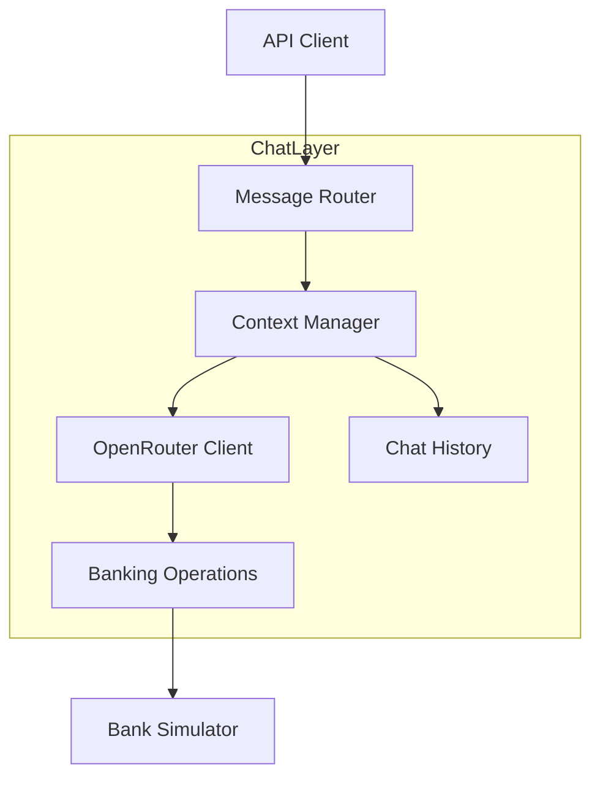
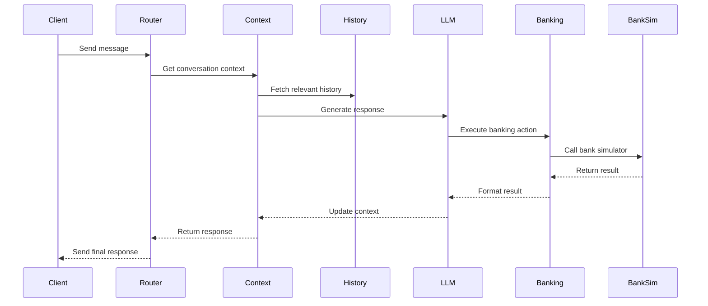

# Chat Layer Architecture Design

## 1. Overview

The chat layer will integrate OpenRouter LLM with the existing banking orchestrator to provide natural language understanding while maintaining the security and functionality of the current system.

## 2. Core Components



## 3. Component Details

### 3.1 Message Router
```typescript
interface MessageRouter {
    route(message: ChatMessage): Promise<RouterResponse>
    validateMessage(message: ChatMessage): boolean
    determineIntent(message: string): Promise<ChatIntent>
}
```

Responsibilities:
- Initial message validation
- Session verification
- Intent classification via OpenRouter
- Route to appropriate handler

### 3.2 Context Manager
```typescript
interface ContextManager {
    buildContext(sessionId: string): Promise<ChatContext>
    updateContext(context: ChatContext, message: ChatMessage): Promise<ChatContext>
    getRelevantHistory(sessionId: string): Promise<ChatMessage[]>
}
```

Responsibilities:
- Maintain conversation state
- Track authentication status
- Build context for LLM
- Manage conversation history

### 3.3 OpenRouter Client
```typescript
interface OpenRouterClient {
    generateResponse(context: ChatContext): Promise<LLMResponse>
    validateResponse(response: LLMResponse): boolean
    extractBankingAction(response: LLMResponse): BankingAction
}
```

Responsibilities:
- Handle OpenRouter API communication
- Prompt engineering and response validation
- Extract structured banking actions
- Error handling and retries

### 3.4 Banking Operations Interface
```typescript
interface BankingOperations {
    executeAction(action: BankingAction): Promise<BankingResult>
    formatResponse(result: BankingResult): string
    validateAction(action: BankingAction): boolean
}
```

Responsibilities:
- Execute banking operations
- Format responses for chat
- Validate banking actions
- Handle banking errors

## 4. Data Flow

### 4.1 Message Processing Flow


## 5. Testing Strategy

### 5.1 Unit Tests
- Message router validation
- Context management
- OpenRouter client mocking
- Banking operations

### 5.2 Integration Tests
```typescript
interface ChatTestSuite {
    testMessageFlow(): Promise<void>
    testBankingOperations(): Promise<void>
    testContextManagement(): Promise<void>
    testErrorHandling(): Promise<void>
}
```

Test scenarios:
1. Basic conversation flow
2. Authentication handling
3. Banking operations
4. Error cases
5. Context preservation

### 5.3 LLM Integration Testing
```typescript
interface OpenRouterClient {
    generateResponse(context: ChatContext): Promise<LLMResponse>
    validateResponse(response: LLMResponse): boolean
    extractBankingAction(response: LLMResponse): BankingAction
    getPromptMetrics(): PromptMetrics
}

interface PromptMetrics {
    tokenUsage: number
    responseTime: number
    completionQuality: number
}
```

Testing Strategy:
- Use real OpenRouter API for all testing
- Validate prompt effectiveness
- Monitor response quality
- Track performance metrics
- Test error handling with API

## 6. Implementation Phases

### Phase 1: Core Integration
1. OpenRouter client implementation
2. Basic prompt engineering
3. Response handling
4. Unit test framework

### Phase 2: Context & Banking
1. Context management
2. Banking action extraction
3. Response formatting
4. Integration tests

### Phase 3: Testing & Refinement
1. Mock LLM implementation
2. Test scenarios
3. Error handling
4. Performance optimization

## 7. Security Considerations

### 7.1 Data Protection
- Sanitize user input before LLM
- Validate LLM responses
- Protect sensitive banking data
- Secure error messages

### 7.2 Session Security
- Validate session tokens
- Maintain authentication state
- Handle session expiry
- Rate limiting

## 8. Error Handling

### 8.1 LLM Errors
- Connection failures
- Invalid responses
- Timeout handling
- Fallback responses

### 8.2 Banking Errors
- Invalid actions
- System unavailable
- Data format errors
- Graceful degradation

## 9. Monitoring

### 9.1 Metrics
- Response times
- Success rates
- Token usage
- Error rates

### 9.2 Logging
- User interactions
- LLM requests/responses
- Banking operations
- Error tracking