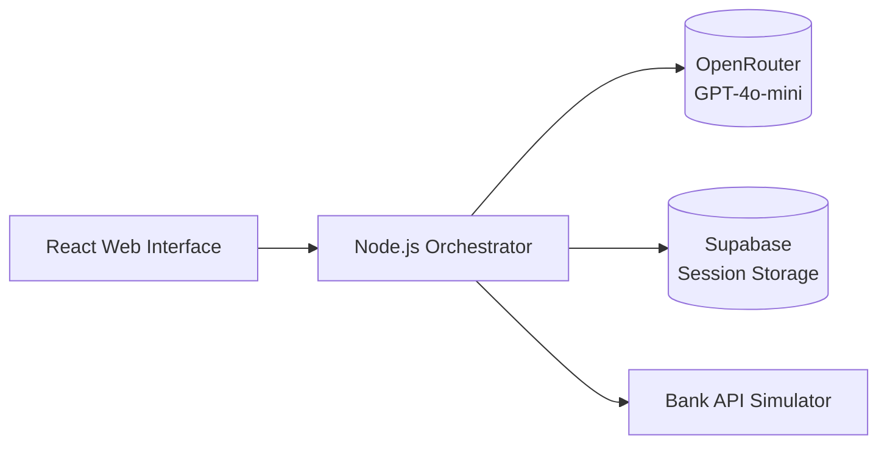

# Banking Chatbot Prototype Design

## 1. Core Architecture

## 2. Data Model (Supabase)
- **customers**: Predefined test records
- **accounts**: Linked to customers with test balances
- **transactions**: Mock transaction history
- **conversation_logs**: All user interactions
- **error_logs**: API failure details

## 3. Bank Simulator Endpoints
1. `POST /auth/validate` - Validate test credentials
   - Request: { accountNumber: "TEST-123", code: "0000" }
   - Response: { valid: boolean }

2. `GET /accounts/{id}/balance` - Return test balance
   - Response: { balance: 1500.00, currency: "USD" }

3. `GET /accounts/{id}/transactions` - Last 5 mock transactions

## 4. Implementation Phases

### Phase 1: Core Authentication Flow
1. Web UI collects account#/code
2. Orchestrator validates via Bank Simulator
3. Store session token in Supabase
4. Basic error logging implementation

### Phase 2: Balance & Transaction Inquiry
1. OpenRouter intent detection
2. Bank Simulator integration
3. Response formatting for financial data

### Phase 3: Local Deployment Setup
1. Docker compose configuration
2. Environment variables setup
3. Basic health check endpoints