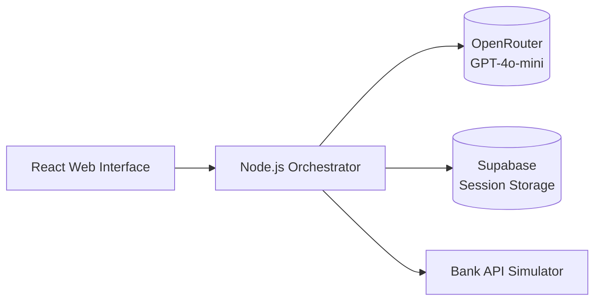

# Banking Chatbot Prototype Design

## 1. Core Architecture

## 2. Data Model (Supabase)
- **customers**: Predefined test records
- **accounts**: Linked to customers with test balances
- **transactions**: Mock transaction history
- **conversation_logs**: All user interactions
- **error_logs**: API failure details

## 3. Bank Simulator Endpoints
1. `POST /auth/validate` - Validate test credentials
   - Request: { accountNumber: "TEST-123", code: "0000" }
   - Response: { valid: boolean }

2. `GET /accounts/{id}/balance` - Return test balance
   - Response: { balance: 1500.00, currency: "USD" }

3. `GET /accounts/{id}/transactions` - Last 5 mock transactions

Example Flow
stateDiagram-v2
    [*] --> Welcome

    state "Welcome" as Welcome {
        note right of Welcome
            1. The Chatbot greets the user:
               "Hello and welcome to XYZ Bank Support.
                Please provide your account number."
        end note
        [*] --> AskAccount
        state AskAccount {
            [*] --> WaitAccountInput
            WaitAccountInput --> ReceivedAccount
            ReceivedAccount --> [*]
        }
    }

    Welcome --> RequestOnlineCode: "User provides account number"

    state "Request Online Code" as RequestOnlineCode {
        note right of RequestOnlineCode
            2. The Chatbot asks for the online banking code.
        end note
        [*] --> WaitCodeInput
        WaitCodeInput --> ReceivedCode
        ReceivedCode --> [*]
    }

    RequestOnlineCode --> Authenticate: "User provides online banking code"

    state "Authenticate via API" as Authenticate {
        note right of Authenticate
            3. The Chatbot calls the API with (accountNumber, onlineCode).
            4. If valid -> returns token
               If invalid -> returns invalid credentials
        end note
        
        [*] --> CheckCredentials
        CheckCredentials --> AuthSuccess: "Valid credentials"
        CheckCredentials --> AuthFail: "Invalid credentials"
        AuthSuccess --> [*]
        AuthFail --> [*]
    }

    Authenticate --> Authenticated: AuthSuccess
    Authenticate --> Invalid: AuthFail

    state "Authenticated" as Authenticated {
        note right of Authenticated
            5. Chatbot has a valid token and can offer 
               further services: "You are now logged in. 
               How can I help you today?"
        end note
        [*] --> [*]
    }

    state "Invalid Credentials" as Invalid {
        note right of Invalid
            6. Chatbot says: 
               "The details provided do not match our records. 
                Would you like to try again?"
        end note
        [*] --> Decision
        state Decision {
            [*] --> TryAgainChoice
            TryAgainChoice --> RestartLogin: "Yes, try again"
            TryAgainChoice --> ExitFlow: "No, exit"
        }
    }

    Invalid --> Decision

    state "Restart Login Flow" as RestartLogin {
        note right of RestartLogin
            If user chooses "Yes", go back to the 
            Welcome step.
        end note
        [*] --> Welcome
    }

    state "Exit Flow" as ExitFlow {
        note right of ExitFlow
            Conversation ends or user is transferred 
            elsewhere.
        end note
        [*] --> [*]
    }

    Authenticated --> BalanceInquiry: "User requests balance"

    state "BalanceInquiry" as BalanceInquiry {
        note right of BalanceInquiry
            - The Chatbot calls something like:
              GET /accounts or GET /accounts/{accountId}/balance 
              using the token.
            - If successful, it returns the balance.
            - The chatbot displays the result to the user.
        end note
        [*] --> FetchBalance
        FetchBalance --> ShowBalance
        ShowBalance --> [*]
    }

    BalanceInquiry --> EndOrContinue: "User sees balance"

    state "EndOrContinue" as EndOrContinue {
        note right of EndOrContinue
            The user can:
             - Perform another action (e.g., payments, transaction history)
             - End the session
        end note
        [*] --> AnotherAction: "Proceed with another service"
        [*] --> ExitFlow: "End session"
    }

    EndOrContinue --> [*]

User Stories

User Story #1: Basic Login

As a bank customer,
I want to provide my account number and online code to the chatbot,
So that I can verify my identity and begin using the banking features.
User Story #2: View Account Balance

As a verified customer,
I want to ask the chatbot for my checking account balance,
So that I can quickly see how much money is available without navigating complex menus.
User Story #3: View Transaction History

As a verified customer,
I want to see a list of recent transactions on my account,
So that I can check deposits, withdrawals, and other activities in one place.
User Story #4: Update Address

As a verified customer,
I want to update my address through the chatbot,
So that I can ensure my bank has my latest contact details without calling or visiting in person.

## 4. Implementation Phases

### Phase 1: Core Authentication Flow
1. Web UI collects account#/code
2. Orchestrator validates via Bank Simulator
3. Store session token in Supabase
4. Basic error logging implementation

### Phase 2: Balance & Transaction Inquiry
1. OpenRouter intent detection
2. Bank Simulator integration
3. Response formatting for financial data

### Phase 3: Local Deployment Setup
1. Docker compose configuration
2. Environment variables setup
3. Basic health check endpoints