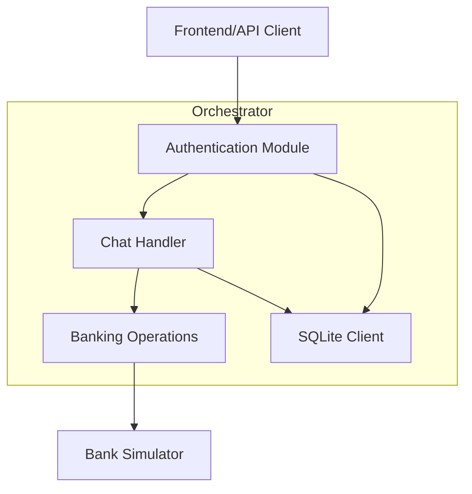
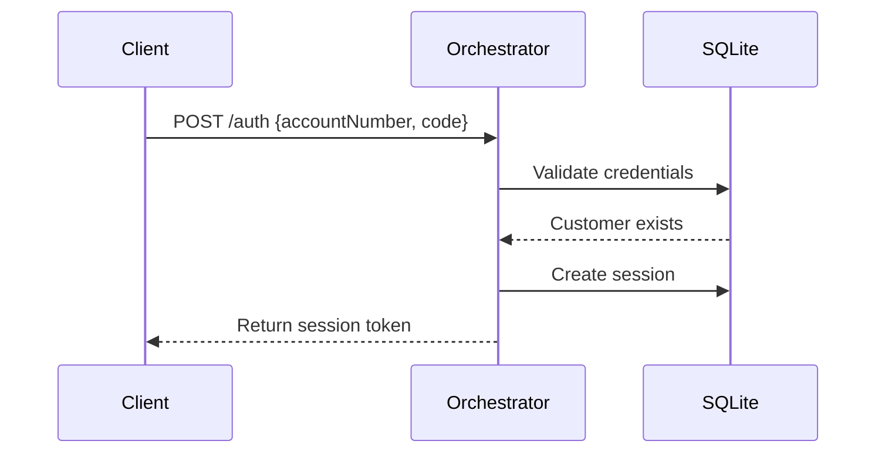
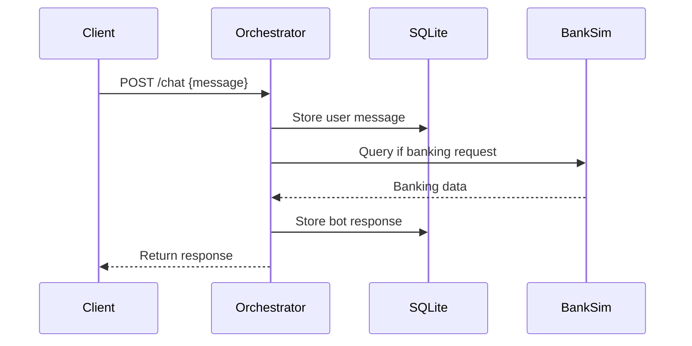

# Orchestrator Service Design

## Core Responsibilities

1. Authentication Management
   - Handle user login requests
   - Validate credentials against SQLite database
   - Generate and manage session tokens
   - Protect routes requiring authentication

2. Chat Session Management
   - Maintain conversation context
   - Store chat history in SQLite
   - Track user session state
   - Handle session timeouts

3. Banking Operations
   - Route balance inquiries to bank simulator
   - Handle transaction history requests
   - Format responses for chat interface
   - Error handling and retries

## Architecture Components



## Key Modules

1. Authentication Module
```typescript
interface AuthModule {
    login(accountNumber: string, code: string): Promise<string>  // Returns session token
    validateToken(token: string): Promise<boolean>
    getSessionInfo(token: string): Promise<SessionInfo>
}
```

2. Chat Handler
```typescript
interface ChatHandler {
    handleMessage(sessionId: string, message: string): Promise<string>
    storeMessage(sessionId: string, message: string, isBot: boolean): Promise<void>
    getConversationHistory(sessionId: string): Promise<Message[]>
}
```

3. Banking Operations
```typescript
interface BankingOps {
    getBalance(accountId: string): Promise<Balance>
    getTransactions(accountId: string): Promise<Transaction[]>
    formatBankingResponse(data: any): string
}
```

## Data Flow

1. Authentication Flow:


2. Chat Flow:


## Implementation Approach

1. Phase 1: Core Authentication
   - Implement SQLite-based authentication
   - Session token generation and validation
   - Protected route middleware
   - Authentication tests

2. Phase 2: Chat Infrastructure
   - Basic message handling
   - Chat history storage
   - Session management
   - Chat flow tests

3. Phase 3: Banking Integration
   - Bank simulator client
   - Balance and transaction handlers
   - Response formatting
   - Integration tests

## Error Handling

1. Authentication Errors
   - Invalid credentials: 401 Unauthorized
   - Invalid token: 401 Unauthorized
   - Missing token: 401 Unauthorized
   - Server errors: 500 Internal Error

2. Chat Errors
   - Invalid message format: 400 Bad Request
   - Session expired: 401 Unauthorized
   - Service unavailable: 503 Service Unavailable

3. Banking Errors
   - Bank simulator down: Graceful degradation
   - Timeout handling: Retry with backoff
   - Data format errors: Safe fallback responses

## Testing Strategy

1. Unit Tests
   - Authentication module
   - Chat message handling
   - Banking operations
   - Error handling

2. Integration Tests
   - SQLite operations
   - Bank simulator integration
   - End-to-end flows

3. Load Tests
   - Concurrent chat sessions
   - Authentication rate limiting
   - Database connection pooling

## Security Considerations

1. Authentication
   - Rate limiting on login attempts
   - Secure session token generation
   - Token expiration and rotation

2. Data Protection
   - Sanitize user input
   - Validate banking responses
   - Secure error messages

3. Session Management
   - Timeout inactive sessions
   - Validate session ownership
   - Clear expired sessions

## Monitoring

1. Health Checks
   - Database connectivity
   - Bank simulator availability
   - Service status endpoint

2. Logging
   - Authentication attempts
   - Chat messages
   - Banking operations
   - Error tracking

3. Metrics
   - Response times
   - Success/failure rates
   - Active sessions